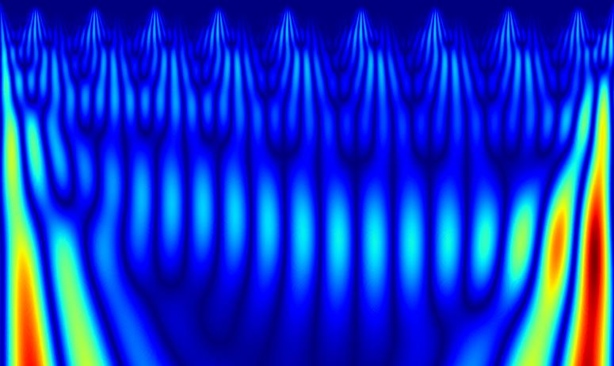
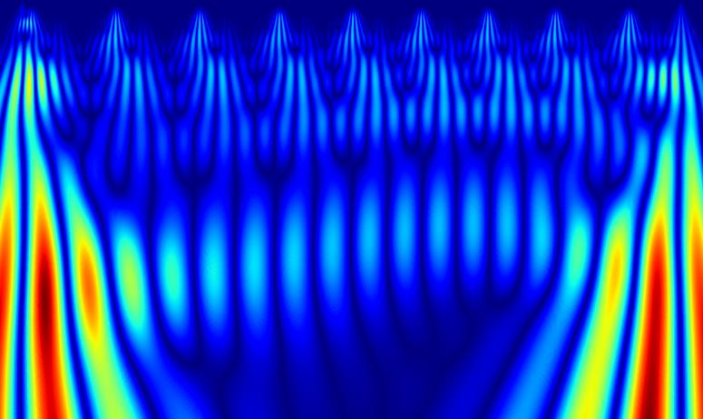
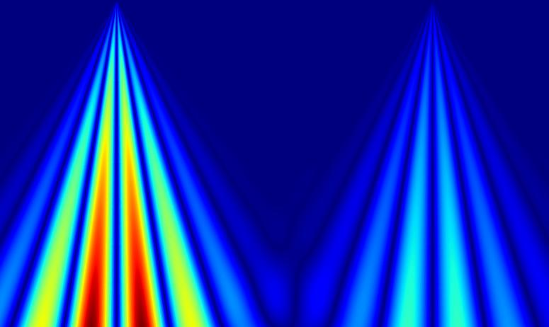
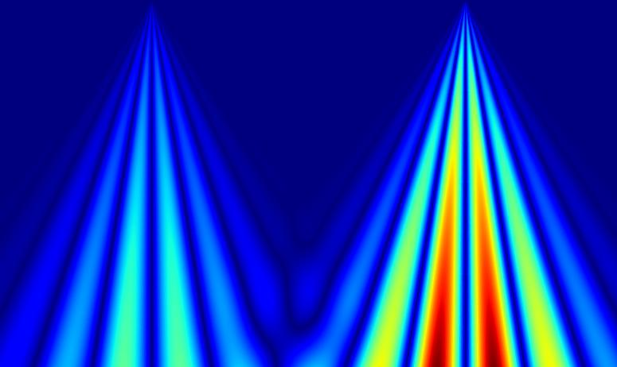

#### Разработка дипломного проекта по анализу биологических сигналов

------

Здесь будут появляться ```заметки, мысли и результаты``` касательно моего дипломного проекта в ```МГТУ им. Н. Э. Баумана.```

------

#### Пайплайн

В рамках решения задачи классификации дыхательных событий на при помощи ЭКГ рассматривается следующий алгоритм:

1. Предварительная обработка ```реографического``` сигнала:

* Фильтрация для выделения тренда ```(вдох-выдох).```

* Применение ```дифференцирующего``` фильтра для формирования разметки.

2. Извлечение признаков из сигнала ```ЭКГ:```

* Применение ```Вейвлет```-преобразования для получения спектрограмм. Для учета информации о предыдущей фазе цикла используется дополнение сигнала перекрытием 

* Формирование обучающей выборки в виде пар ```окно ЭКГ``` - ```окно РЕО.```

---------

#### Примеры изображений-матриц для ЭКГ сигнала



Фаза ```выдоха``` по ЭКГ



Фаза ```вдоха``` по ЭКГ

---------

#### Примеры изображений-матриц для Реографического сигнала



Фаза ```выдоха``` по Рео



Фаза ```вдоха``` по Рео

---------

3. Разработка архитектуры модели на основе свёрточных нейронных сетей ```(CNN)``` и подхода ```Metric Learning.```

    3.1. В качестве ```Backbone``` свёрточной сети используется архитектура ```ResNet``` с ```18``` блоками.

    3.2. Для решения задачи выучивания эмбеддингов используется ```Triplet Loss``` с значением ```margin = 1.0```

    3.3. Размерность латентного представления выбрана ```dim = 128```. Шаг сходимости оптимизационного алгоритма ```learning_rate = 1e-5```

    3.4 Полученная метрика точности классифкации на валидационном множестве: ```accuracy ~ 0.98.``` Итоговый ```Validation Loss ~ 0.4222.``` Среднее расстояние между эмбеддингами по Евклиду ```~5.30.```

--------
4. Логи обучения [тык](notebooks/tb_logs/ecg_reo_metric_learning/version_22)

#### Горностай

